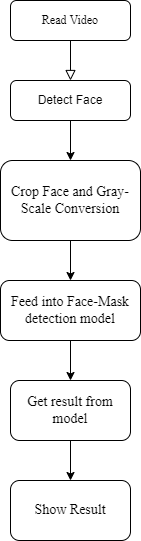
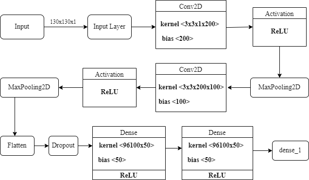
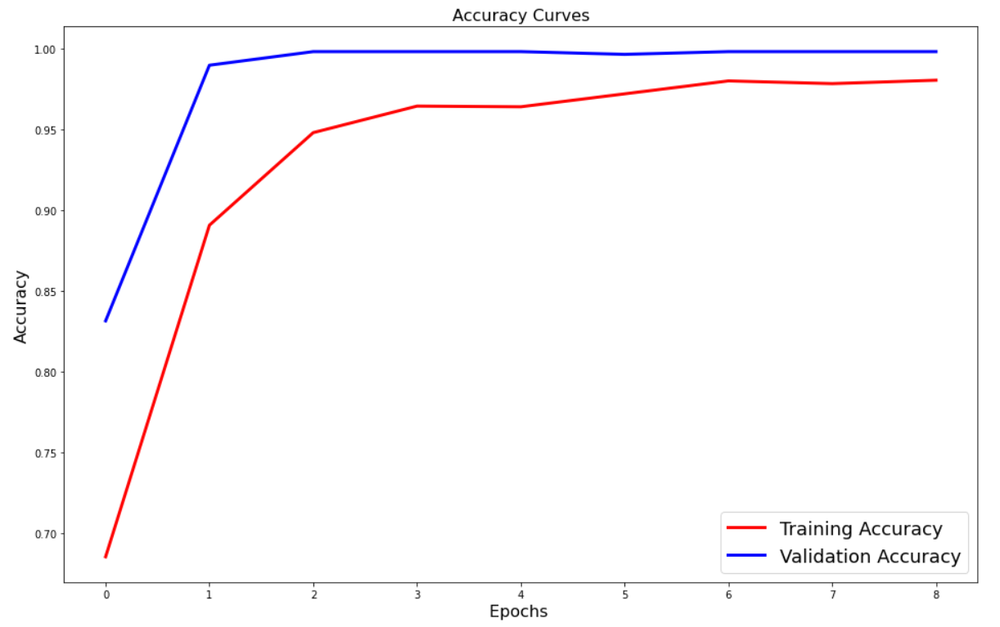
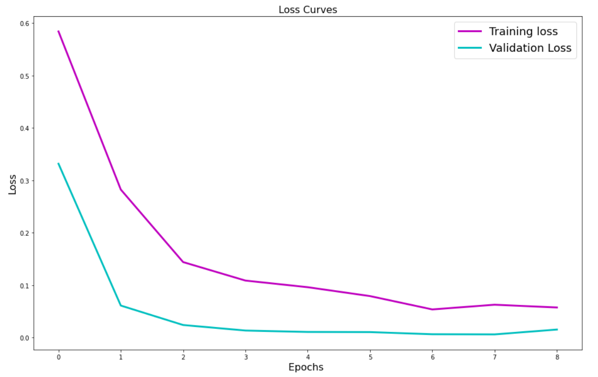

# Face-Mask-Detection-System

Face Mask Detection System and Data Collector System Using Tensorflow and MTCNN. It is real time Face Mask Detection System which used MTCNN for landmark detection and use model created from the CNN architecture for face mask detection system. The data required for training and testing the model were collected from scratch using Data Collector tool which also uses MTCNN for face capture for masked and unmasked faces.
### Working Methodology of system

### Architecture of our CNN model

### Installing

Please refer the requirement.txt file for the installing the prerequisite for this project.

### Results
#### Accuracy and Loss of our model

#### Working Demo 
.png)
![Alt text]](Images/Images/Screenshot (23).png)
.png)
.png)

## Authors

* **Group Project created for academic Major Project with my teammates: Simon Bista, Mahesh Mahato,Prasanna Khati** - [xafold](https://github.com/xafold)

## Acknowledgments
Special thanks to  [R4j4n](https://github.com/R4j4n) fro helping us in this project and all my friend for contributing for data collection process

